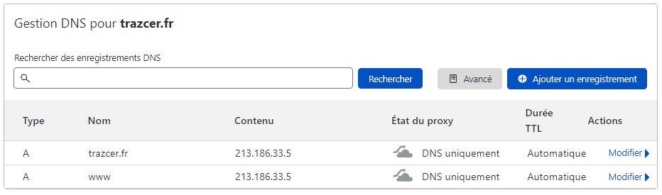

# Traefik HTTPS / TLS / Let’s Encrypt Lab

# Pré-requis

** Pour réalise cet labo vous serez plus à l'aise en prenant un nom de domaine chez cloudfare pour exemple dans ce labo
Voici la liste des provider pris en charge par Traefik  [https://docs.traefik.io/v2.3/https/acme/#providers](https://docs.traefik.io/v2.3/https/acme/#providers)

1. Assurez-vous d’avoir un nom de domaine
2. Pointer  un enregistrement sur votre ip publique de votre VPS ou de votre routeur.
3. Il y aura un sous dossier pour chaque méthode dans ce labo.
4. Voici l'extrait de notre Lab, pour cette section:


 


## 1. Deployer Traefik methode Let's Encrypt HTTP Challenge
1. Arretez et supprimer tout les conteneurs par cette commande : docker rm $(docker ps -a -q)
3. Ouvez le ficher `Docker-compose.yml`par votre editeur de text et par rapport à notre dernier LAB, une section à  été ajouter.
4. Verifier que l'adresse mail que vous renseigner est  joignable pour la validation
5. Edite le fichier `.env` et ajouter la racine de votre nom de domaine 
6. Lancer la pile `docker-compose up` afin d'observer les logs directement de la pile.
7. Via votre navigateur acceder au Dashboard Traefik  `http://your_domain_here:8080` verifier ensuite que Traefik et nos services sont en HTTPS.
8. Vous devez normalement observer votre site whoami.xxxx.fr est bien servi avec HTTPS et sont propre certifcat Let's Encrypt

## 2. Deployer Traefik methode Let's Encrypt TLS Challenge
1. Arretez et supprimer tout les conteneurs par cette commande : docker rm $(docker ps -a -q)
2. Deplacez vous dans le dossier `Methode TLS` de notre labo `04-Traefik-HTTPS-&-TLS`
3. Ouvrez le fichier `Docker-compose.yml` a la ligne 24 le changement à été fait pour le `Challenge TLS`
4. Edite le fichier `.env` et ajouter la racine de votre nom de domaine 
5. Lancer la pile `docker-compose up` afin d'observer les logs directement de la pile.
6. Via votre navigateur acceder au Dashboard Traefik  `http://your_domain_here:8080` verifier ensuite que Traefik et nos services sont en HTTPS.
7. Vous devez normalement observer votre site whoami.xxxx.fr est bien servi avec HTTPS et sont propre certifcat Let's Encrypt

## 3. Deployer Traefik methode Let's Encrypt DNS Challenge
1. Arretez et supprimer tout les conteneurs par cette commande : docker rm $(docker ps -a -q)
2. Deplacez vous dans le dossier `Methode DNS` de notre labo `04-Traefik-HTTPS-&-TLS`
3. Ouvez le ficher `.env`dans votre editeur de text
4. Rendez-vous chez votre fournissuer DNS. Retrouver la liste ici [Traefik providers](https://docs.traefik.io/v2.3/https/acme/#providers). 
5. Pour ceux qui travaillent avec cloudfare voici un exemple de notre fichier `.env` avec les variables nécéssaires à récuperer
````dosini
DOMAINNAME=trazcer.fr
CLOUDFLARE_ZONEID=c6595ef4ed7de97a94a3efaf05886
CLOUDFLARE_APITOKEN=-DlClDkZ-l_ELoIklaCK7AiH999U2vvDPhDOZ
CLOUDFLARE_EMAIL=gregory.narcin@icloud.com
````
6. Ensuite ouvrez le fichier `docker-compose.dns.yml` a la `ligne 24` dans la section pour le challenge ajouter le bloc ci-dessous :
````
      ##- --certificatesResolvers.dns-cloudflare.acme.caServer=https://acme-staging-v02.api.letsencrypt.org/directory 
      - --certificatesResolvers.dns-cloudflare.acme.email=$CLOUDFLARE_EMAIL
      - --certificatesResolvers.dns-cloudflare.acme.storage=./letsencrypt/acme.json
      - --certificatesResolvers.dns-cloudflare.acme.dnsChallenge.provider=cloudflare
      - --certificatesResolvers.dns-cloudflare.acme.dnsChallenge.resolvers=1.1.1.1:53,1.0.0.1:53
      - --certificatesResolvers.dns-cloudflare.acme.dnsChallenge.delayBeforeCheck=90
    environment:
      - CF_API_EMAIL=CLOUDFLARE_EMAIL
      - CF_API_KEY=$CLOUDFLARE_APITOKEN
````
7. decommenter la ligne `- --certificatesResolvers.dns-cloudflare.acme.caServer.... ` pour le mode stagging (Facultatif)
8. Lancer la pile `docker-compose up` afin d'observer les logs directement de la pile. Cependant cette methode nécéssite plus de temps.
9. Via votre navigateur acceder au Dashboard Traefik  `http://your_domain_here:8080` verifier ensuite que Traefik et nos services sont en HTTPS.
10.  Vous devez normalement observer votre site whoami.xxxx.fr est bien servi avec HTTPS et sont propre certifcat Let's Encrypt

## Deployer Traefik avec un certificat.
1. Arretez et supprimer tout les conteneurs par cette commande : docker rm $(docker ps -a -q)
2. Deplacez vous dans le dossier `Methode CERTIFICAT` de notre labo `04-Traefik-HTTPS-&-TLS`
3. Dans le fichier `root.cnf` et `server.cnf` modifier les variables : `organizationName` ,`commonName `
4. Dans le fichier  `server.cnf` ajouter dans `alt_names`  liste des DNS qui seront validés par le certificat
5. Toujours dans positionner dans le dossier `Methode CERTIFICAT`, générer le certficat avec ces commandes
```bash
openssl req -x509 -new -keyout root.key -out root.cer -config root.cnf
openssl req -nodes -new -keyout server.key -out server.csr -config server.cnf
openssl x509 -days 825 -req -in server.csr -CA root.cer -CAkey root.key -set_serial 123 -out server.cer -extfile server.cnf -extensions x509_ext
```

5. Une fois les certificat générer installer les certificat sur la machine cliente.
6. Ajouter 

## 3.1 Use Wildcard Let's Encrypt Certificate
1. Arretez et supprimer tout les conteneurs par cette commande : docker rm $(docker ps -a -q)
2. Deplacez vous dans le dossier `Methode DNS` de notre labo `04-Traefik-HTTPS-&-TLS`
3. Supprimer le fichier acme.json dans le dossier `letsencrypt`
3. Ouvrez le fichier `Docker-compose.yml` et ajouter les labels ci-dessous dans le service Traefik pour générer un Wildcard.
````yml
    labels:
      traefik.enable: true
      traefik.http.routers.traefik.entrypoints: websecure
      traefik.http.routers.wildcard-certs.tls.certresolver: cloudflare
      traefik.http.routers.wildcard-certs.tls.domains[0].main: ${DOMAINNAME}
      traefik.http.routers.wildcard-certs.tls.domains[0].sans: '*.${DOMAINNAME}'
````
8. Lancer la pile `docker-compose up` afin d'observer les logs directement de la pile.
3. Ouvrer le fichier acme.json, il contient maintenant le wildcard. En exemple sur notre labo : 
````json
    "Certificates": [
      {
        "domain": {
          "main": "trazcer.fr",
          "sans": [
            "*.trazcer.fr"
          ]
````

# # Poursuivre vers le LAB Bonus

### Clique ici ->  [05-Traefik-BONUS](https://github.com/56kcloud/traefik-training/blob/master/05-Middlewares/traefik-middlewares.md)